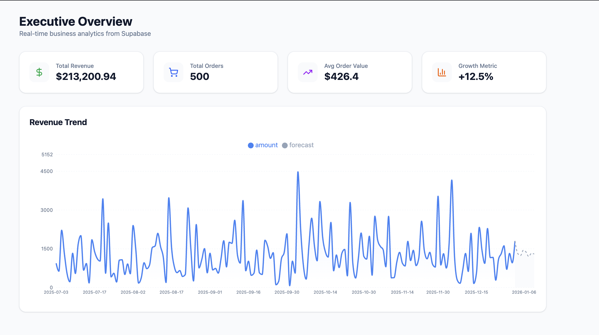

# 📊 Executive Sales Analytics & Predictive Dashboard

A professional full-stack business intelligence platform that integrates real-time PostgreSQL data with custom predictive logic to visualize sales trends and future revenue forecasts.




## 🚀 Project Overview

This project demonstrates an end-to-end data pipeline:
1.  **Data Ingestion**: Storing and managing complex sales transactions in **Supabase (PostgreSQL)**.
2.  **API Layer**: A high-performance **FastAPI** backend that performs on-the-fly data aggregation using **Pandas**.
3.  **Predictive Modeling**: Implementation of a **Weighted Moving Average** algorithm to generate a 7-day revenue forecast with realistic market volatility.
4.  **Data Visualization**: A responsive **React** dashboard featuring "stitched" time-series charts using **Recharts**.

## 🛠️ Tech Stack

### Backend (The Engine)
* **FastAPI**: Asynchronous Python framework for high-speed API endpoints.
* **Pandas & NumPy**: For vectorized data manipulation and statistical calculations.
* **Supabase-py**: Direct integration with cloud-native PostgreSQL.
* **Python-dotenv**: Secure management of environment variables and API keys.

### Frontend (The Interface)
* **React (Vite)**: Modern UI library for a fast, reactive user experience.
* **Tailwind CSS**: Utility-first styling for a clean, executive aesthetic.
* **Recharts**: Composable charting library used for multi-series area charts.
* **Lucide React**: For consistent, high-quality iconography.

## 📈 Predictive Logic

The dashboard features a 7-day revenue forecast. Although initially started as a simple linear trend using linear regression, I alterted the model to use a **14-day Moving Average baseline** combined with **Gaussian-style random variation (±15%)** to simulate real-world retail fluctuations.

The frontend utilizes a "stitching" algorithm to ensure the transition between historical data (solid blue) and forecasted data (dashed grey) is seamless at the current date.

## ⚙️ Installation & Setup

### 1. Prerequisites
* Node.js (v18+)
* Python (3.9+)
* A Supabase Project with a `sales` table (columns: `timestamp`, `amount`)

### 2. Backend Setup
```
cd backend
python -m venv venv
source venv/bin/activate  # Windows: venv\Scripts\activate
pip install -r requirements.txt
# Create a .env file with your SUPABASE_URL and SUPABASE_KEY
uvicorn main:app --reload
```

### 3. Frontend Setup 
```
cd frontend
npm install
npm run dev
```

## 🔒 Security
Sensitive credentials (Supabase Keys) are managed through environment variables and protected via .gitignore to prevent exposure in public repositories.
